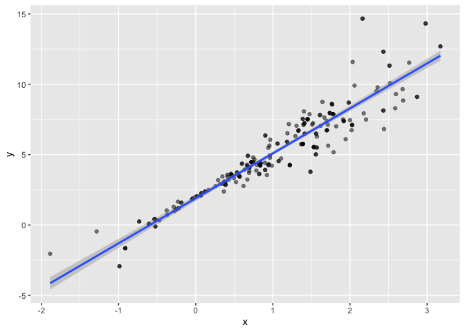

Bootstrapping
================
2024-11-18

``` r
library(tidyverse)
```

    ## ── Attaching core tidyverse packages ──────────────────────── tidyverse 2.0.0 ──
    ## ✔ dplyr     1.1.4     ✔ readr     2.1.5
    ## ✔ forcats   1.0.0     ✔ stringr   1.5.1
    ## ✔ ggplot2   3.5.1     ✔ tibble    3.2.1
    ## ✔ lubridate 1.9.3     ✔ tidyr     1.3.1
    ## ✔ purrr     1.0.2     
    ## ── Conflicts ────────────────────────────────────────── tidyverse_conflicts() ──
    ## ✖ dplyr::filter() masks stats::filter()
    ## ✖ dplyr::lag()    masks stats::lag()
    ## ℹ Use the conflicted package (<http://conflicted.r-lib.org/>) to force all conflicts to become errors

``` r
library(modelr)
library(p8105.datasets)


set.seed(1)
```

do some boostrapping!!

make up some data

``` r
n_samp=250

sim_df_constant=
  tibble(
    x=rnorm(n_samp, 1, 1),
    error= rnorm(n_samp, 0, 1),
    y=2 +3*x + error
  )

sim_df_nonconstant=
  sim_df_constant |> 
  mutate(
    error= error * .75 * x,
     y=2 +3*x + error
  )
```

Lets look at these.

``` r
sim_df_constant |> 
  ggplot(aes(x=x, y=y))+
  geom_point()+
  stat_smooth(method = "lm")
```

    ## `geom_smooth()` using formula = 'y ~ x'

<!-- -->

``` r
sim_df_nonconstant |> 
  ggplot(aes(x=x, y=y))+
  geom_point()+
  stat_smooth(method = "lm")
```

    ## `geom_smooth()` using formula = 'y ~ x'

<!-- --> when x
gets close to zero, residuals get really tight can see uncertainty put
in wrong place based on grey lines

look at regression results

``` r
sim_df_constant |> 
  lm(y~x, data= _) |> 
  broom::tidy() |> 
  knitr::kable(digits = 3)
```

| term        | estimate | std.error | statistic | p.value |
|:------------|---------:|----------:|----------:|--------:|
| (Intercept) |    1.977 |     0.098 |    20.157 |       0 |
| x           |    3.045 |     0.070 |    43.537 |       0 |

``` r
sim_df_nonconstant |> 
  lm(y~x, data= _) |> 
  broom::tidy() |> 
  knitr::kable(digits = 3)
```

| term        | estimate | std.error | statistic | p.value |
|:------------|---------:|----------:|----------:|--------:|
| (Intercept) |    1.934 |     0.105 |    18.456 |       0 |
| x           |    3.112 |     0.075 |    41.661 |       0 |

std error for x and intercept pretty close, when they shouldnt be (we
probably know more about intercept)

## Draw a bootstrap sample

``` r
boot_sample= function(df) {
  
  boot_df=
    sample_frac(df, replace = TRUE) |> 
    arrange(x)
  
  return(boot_df)
}
```

Lets try running this

``` r
sim_df_nonconstant |> 
  boot_sample() |> 
  ggplot(aes(x=x, y=y))+
  geom_point(alpha=.5)+
  stat_smooth(method="lm")
```

    ## `geom_smooth()` using formula = 'y ~ x'

<!-- --> df is
arranged by x and we see repeats bc replace=TRUE some points grey and
some darker (repeats) each bootstrap is giving us a slightly diff
regression fit. bootstrap sample should reflect actual variability in
data that we have..variability is what we care about

Can we do this as part of an analysis? yes!

``` r
sim_df_nonconstant |> 
  boot_sample() |> 
   lm(y~x, data= _) |> 
  broom::tidy() |> 
  knitr::kable(digits = 3)
```

| term        | estimate | std.error | statistic | p.value |
|:------------|---------:|----------:|----------:|--------:|
| (Intercept) |    1.896 |     0.098 |    19.311 |       0 |
| x           |    3.142 |     0.069 |    45.636 |       0 |

goal is generate 1000 datasets and pull out results

## Bootstrap a LOT

``` r
boot_straps=
  tibble(
    strap_number=1:1000
  ) |> 
  mutate(
    strap_sample= map(strap_number, \(i) boot_sample(df=sim_df_nonconstant)),
    models=map(strap_sample, \(df) lm(y~x, data=df)),
    results=map(models, broom::tidy)
  )

bootstrap_results=
  boot_straps |> 
  select(strap_number, results) |> 
  unnest(results) |> 
  group_by(term) |> 
  summarize(
    boot_se= sd(estimate)
  ) |> 
  knitr::kable(digits=3)
```

if wanted to look at each one , in console: boot_straps \|\>
pull(strap_sample) \|\> nth(1)

from bootstrap results…now intercept has lower variability and slope has
higher variability compared to nonconstant distribution

if used sim_df_constant, no violation of assumptions, so we would get
basically same results with bootstrap_results

## could do this using modelr

``` r
boot_straps=
  sim_df_constant |> 
  modelr::bootstrap(1000) |> 
  mutate(
    strap=map(strap, as_tibble),
    models=map(strap, \(df) lm(y~x, data=df)),
    results=map(models, broom::tidy)
  ) |> 
  select(.id, results) |> 
  unnest(results)
```

.id tells us first bootstrap sample, second bootstrap sample, etc.

## what do you want to report

``` r
boot_straps |> 
  group_by(term) |> 
  summarize(
    boot_est=mean(estimate),
    boot_se=sd(estimate),
     boot_ci_ll=quantile(estimate, .025),
    boot_ci_ul=quantile(estimate, .975)
  )
```

    ## # A tibble: 2 × 5
    ##   term        boot_est boot_se boot_ci_ll boot_ci_ul
    ##   <chr>          <dbl>   <dbl>      <dbl>      <dbl>
    ## 1 (Intercept)     1.98  0.0984       1.78       2.16
    ## 2 x               3.04  0.0720       2.91       3.19

## Airbnb

``` r
data("nyc_airbnb")

manhattan_df = 
  nyc_airbnb |> 
  mutate(stars = review_scores_location / 2) |> 
  rename(
    borough = neighbourhood_group,
    neighborhood = neighbourhood) |> 
  filter(borough == "Manhattan") |> 
  select(price, stars, room_type) |> 
  drop_na()
```

plot the data

``` r
manhattan_df |> 
  ggplot(aes(x=stars, y=price)) +
  geom_point()+
  stat_smooth(method= "lm", se=FALSE)
```

    ## `geom_smooth()` using formula = 'y ~ x'

<!-- -->
clearly not constant variance

fit a regression..but we dont trust the SE

``` r
manhattan_df |> 
  lm(price~stars+room_type, data=_) |> 
  broom::tidy() |> 
  knitr::kable(digits = 3)
```

| term                  | estimate | std.error | statistic | p.value |
|:----------------------|---------:|----------:|----------:|--------:|
| (Intercept)           |   95.694 |    22.186 |     4.313 |       0 |
| stars                 |   27.110 |     4.585 |     5.913 |       0 |
| room_typePrivate room | -124.188 |     3.464 |   -35.848 |       0 |
| room_typeShared room  | -153.635 |    10.052 |   -15.285 |       0 |

bootstrap for better(?) inference

``` r
boot_results=
manhattan_df |> 
  modelr::bootstrap(1000) |> 
  mutate(
    strap=map(strap, as_tibble),
    models=map(strap, \(df) lm(price~stars + room_type, data=df)),
    results=map(models, broom::tidy)
  ) |> 
  select(.id, results) |> 
  unnest(results)

boot_results |> 
  filter(term=="stars") |> 
  ggplot(aes(x=estimate))+
  geom_density()
```

<!-- -->

``` r
boot_results |> 
  group_by(term) |> 
  summarize(
    boot_est=mean(estimate),
    boot_se=sd(estimate),
     boot_ci_ll=quantile(estimate, .025),
    boot_ci_ul=quantile(estimate, .975)
  )
```

    ## # A tibble: 4 × 5
    ##   term                  boot_est boot_se boot_ci_ll boot_ci_ul
    ##   <chr>                    <dbl>   <dbl>      <dbl>      <dbl>
    ## 1 (Intercept)               95.3   30.4        43.8      157. 
    ## 2 room_typePrivate room   -124.     3.31     -130.      -118. 
    ## 3 room_typeShared room    -154.     3.06     -159.      -148. 
    ## 4 stars                     27.2    6.14       15.1       37.6

taking 1000 bootstrap samples, fitted linear regressions of each of
them, and each time i have estimated slope for effect of stars and we
are plotting what this looks like. looks mostly like a normal
distribution but left tail is a little long (can see large outliers
having a slight effect)

now SE is still large for stars is still 6.19 (more variable than lm) bc
it is a really skewed distrib in the residuals and we are getting
results we dont expect
