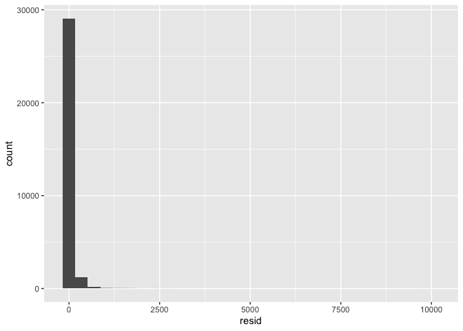
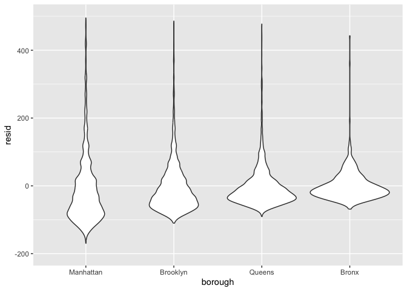
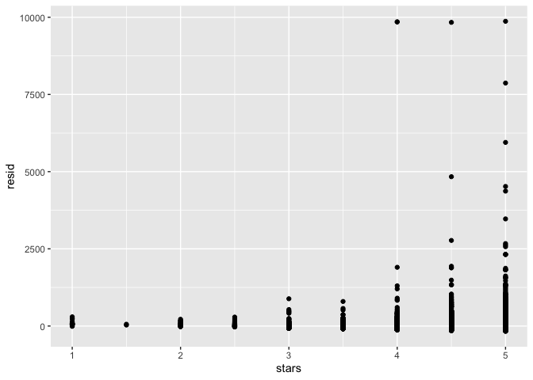

Linear_Models
================
2024-11-08

``` r
library(tidyverse)
```

    ## ── Attaching core tidyverse packages ──────────────────────── tidyverse 2.0.0 ──
    ## ✔ dplyr     1.1.4     ✔ readr     2.1.5
    ## ✔ forcats   1.0.0     ✔ stringr   1.5.1
    ## ✔ ggplot2   3.5.1     ✔ tibble    3.2.1
    ## ✔ lubridate 1.9.3     ✔ tidyr     1.3.1
    ## ✔ purrr     1.0.2     
    ## ── Conflicts ────────────────────────────────────────── tidyverse_conflicts() ──
    ## ✖ dplyr::filter() masks stats::filter()
    ## ✖ dplyr::lag()    masks stats::lag()
    ## ℹ Use the conflicted package (<http://conflicted.r-lib.org/>) to force all conflicts to become errors

``` r
library(p8105.datasets)
```

Do some data cleaning

``` r
data("nyc_airbnb")
nyc_airbnb=
  nyc_airbnb |> 
  mutate(stars= review_scores_location/2) |> 
  rename(
    borough =neighbourhood_group,
    neighborhood= neighbourhood
  ) |> 
  filter(
    borough != "Staten Island"
  ) |> 
  select(price, stars, borough, neighborhood, room_type) |> 
  mutate(
    borough=fct_infreq(borough),
    room_type=fct_infreq(room_type)
  )
```

adding last mutate step used to change ref category in order of freq
instead of ABC order

## Fit some models

start relatively simple

``` r
fit= lm(price ~ stars, data=nyc_airbnb)

summary(fit)
```

    ## 
    ## Call:
    ## lm(formula = price ~ stars, data = nyc_airbnb)
    ## 
    ## Residuals:
    ##    Min     1Q Median     3Q    Max 
    ## -144.1  -69.1  -32.0   25.9 9889.0 
    ## 
    ## Coefficients:
    ##             Estimate Std. Error t value Pr(>|t|)    
    ## (Intercept)  -66.500     11.893  -5.591 2.27e-08 ***
    ## stars         44.115      2.515  17.538  < 2e-16 ***
    ## ---
    ## Signif. codes:  0 '***' 0.001 '**' 0.01 '*' 0.05 '.' 0.1 ' ' 1
    ## 
    ## Residual standard error: 183.8 on 30528 degrees of freedom
    ##   (9962 observations deleted due to missingness)
    ## Multiple R-squared:  0.009974,   Adjusted R-squared:  0.009942 
    ## F-statistic: 307.6 on 1 and 30528 DF,  p-value: < 2.2e-16

``` r
names(summary(fit))
```

    ##  [1] "call"          "terms"         "residuals"     "coefficients" 
    ##  [5] "aliased"       "sigma"         "df"            "r.squared"    
    ##  [9] "adj.r.squared" "fstatistic"    "cov.unscaled"  "na.action"

``` r
coef(fit)
```

    ## (Intercept)       stars 
    ##   -66.50023    44.11475

``` r
broom::tidy(fit)
```

    ## # A tibble: 2 × 5
    ##   term        estimate std.error statistic  p.value
    ##   <chr>          <dbl>     <dbl>     <dbl>    <dbl>
    ## 1 (Intercept)    -66.5     11.9      -5.59 2.27e- 8
    ## 2 stars           44.1      2.52     17.5  1.61e-68

``` r
fit |> 
  broom::tidy() |> 
  select(term, estimate, p.value)
```

    ## # A tibble: 2 × 3
    ##   term        estimate  p.value
    ##   <chr>          <dbl>    <dbl>
    ## 1 (Intercept)    -66.5 2.27e- 8
    ## 2 stars           44.1 1.61e-68

``` r
fit |> 
  broom::glance()
```

    ## # A tibble: 1 × 12
    ##   r.squared adj.r.squared sigma statistic  p.value    df   logLik     AIC    BIC
    ##       <dbl>         <dbl> <dbl>     <dbl>    <dbl> <dbl>    <dbl>   <dbl>  <dbl>
    ## 1   0.00997       0.00994  184.      308. 1.61e-68     1 -202491. 404989. 4.05e5
    ## # ℹ 3 more variables: deviance <dbl>, df.residual <int>, nobs <int>

most often uses broom::tidy() line of code bc will format in form of a
df and can select and stuff like that

Try a bit more complex

``` r
fit= 
  lm(price~stars + borough, data=nyc_airbnb)

fit |> 
  broom::tidy() |> 
  select(term, estimate, p.value) |> 
  mutate(
    term= str_replace(term, "borough", "Borough: ")
  ) |> 
  knitr::kable(digits=3)
```

| term              | estimate | p.value |
|:------------------|---------:|--------:|
| (Intercept)       |   19.839 |   0.104 |
| stars             |   31.990 |   0.000 |
| Borough: Brooklyn |  -49.754 |   0.000 |
| Borough: Queens   |  -77.048 |   0.000 |
| Borough: Bronx    |  -90.254 |   0.000 |

## Some diagnostics

(backtrack to some EDA)

``` r
nyc_airbnb |> 
  ggplot(aes(x=stars, y=price))+
  geom_point()+
  stat_smooth(method="lm")
```

    ## `geom_smooth()` using formula = 'y ~ x'

    ## Warning: Removed 9962 rows containing non-finite outside the scale range
    ## (`stat_smooth()`).

    ## Warning: Removed 9962 rows containing missing values or values outside the scale range
    ## (`geom_point()`).

<!-- -->

Most diagnostics use residuals

``` r
modelr::add_residuals(nyc_airbnb, fit) |> 
  ggplot(aes(x=resid)) +
  geom_histogram()
```

    ## `stat_bin()` using `bins = 30`. Pick better value with `binwidth`.

    ## Warning: Removed 9962 rows containing non-finite outside the scale range
    ## (`stat_bin()`).

<!-- --> first
modelr:: line creates new df with residuals added to table of nyc_airbnb

``` r
modelr::add_residuals(nyc_airbnb, fit) |> 
  ggplot(aes(x=borough, y=resid)) +
  geom_violin()+
  ylim(-200,500)
```

    ## Warning: Removed 10202 rows containing non-finite outside the scale range
    ## (`stat_ydensity()`).

<!-- --> highly
skewed residuals apparent

Residuals against stars

``` r
modelr::add_residuals(nyc_airbnb, fit) |> 
  ggplot(aes(x=stars, y=resid)) +
  geom_point()
```

    ## Warning: Removed 9962 rows containing missing values or values outside the scale range
    ## (`geom_point()`).

<!-- -->

Residuals against fitted values

``` r
nyc_airbnb |> 
  modelr::add_residuals(fit) |> 
  modelr::add_predictions(fit) |> 
  ggplot(aes(x=pred, y=resid)) +
  geom_point()
```

    ## Warning: Removed 9962 rows containing missing values or values outside the scale range
    ## (`geom_point()`).

<!-- -->
